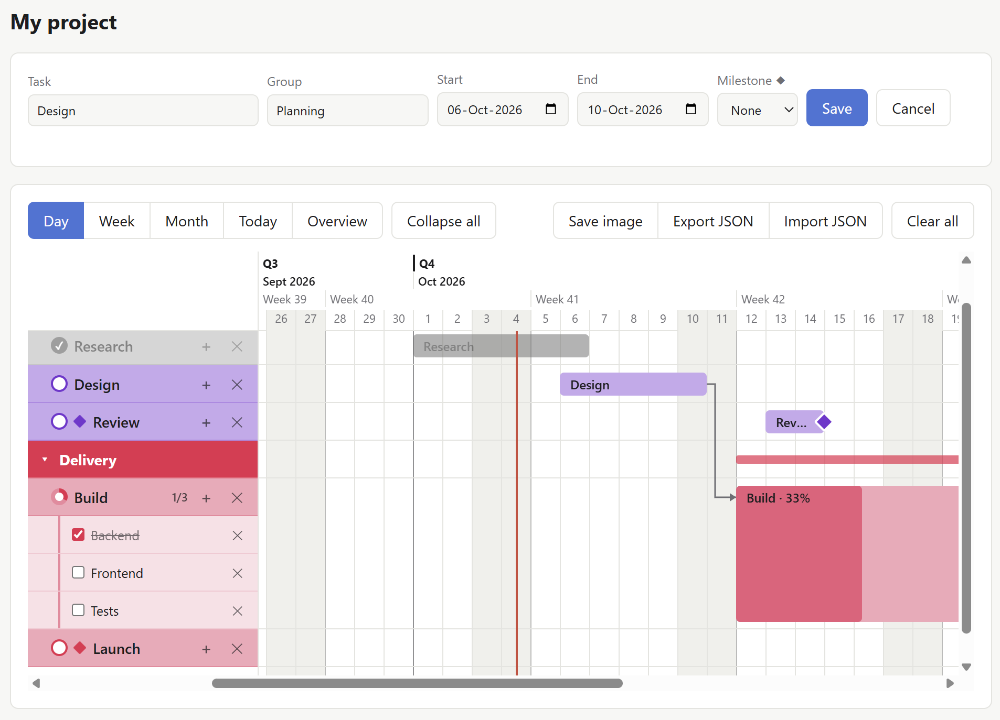

# Simple Gantt

A simple, straight-to-the-point Gantt chart that runs in your browser. It is a
single HTML file with no install, no build step and no dependencies.



## Getting started

Open `index.html` in any modern browser (Chrome, Edge, Firefox, Safari).

On the first run, a few example tasks are added so the chart isn't empty.
Remove them with **Clear all**.

## Features

### Tasks
- **Add a task:** enter a name, an optional group, a start date and an end date, then click **Add task**. Or drag across empty days in the chart (see *Creating a task by dragging*).
- **Rename** a task, subtask or group: click its name in the list, type, and press **Enter** (or click elsewhere, or straight on the next name); **Esc** cancels. Renaming a group to the name of another group merges them.
- **Edit a task's dates, group or milestone:** double-click its bar in the chart or its row in the list, change the details, then click **Save**.
- **Delete a task:** click ✕ in the list.
- A task's end date is included, so a task from the 3rd to the 5th lasts 3 days.

### Row buttons
Each task row has 📎 (links), + (add subtask) and ✕ (delete); subtask rows have
📎 and ✕. To keep the list clean they only show when needed: with a mouse,
while you **hover** the row; on a phone or tablet, after you **tap** the row
(tap the name again to rename it; tap elsewhere to hide the buttons). A 📎 with
links is always shown. Hidden buttons can't be clicked by accident.

### On a phone
On narrow screens the app adapts:

- It opens on a **Schedule**: you scroll **down** through time. Each week is a heading ("Week 41 · 5–11 Oct"), starting at this week, which also lists tasks still running from earlier weeks. Each task is a card with its colour, status circle, name, dates, group, subtask count and 📎. Tap a card to open it: tick off subtasks, open its links, or tap **Edit** for dates, group and milestone.
- **Schedule | Chart** at the top switches to the Gantt chart, **turned a quarter** so you also scroll **down** through time: dates run down the left side and each task is a vertical bar in its own column, with its name written inside (in its group's colour, with its progress and ◆ milestones). Each group has a thin column with a line over the group's dates (tap it to collapse or expand the group). Wherever a quarter, month or week begins, a band shows that information stacked ("Q4 · Oct 2026 · Week 40"), and every day shows its label ("Thu 1"). The dates stay in place while you scroll sideways. Day / Week / Month / Quarter, ‹ ›, Today and Overview work up/down (a long period may need a little scrolling), and a pinch zooms.
- **Tap a task** (in the Chart, or **Open task** on a Schedule card) to open its **sheet**. It opens showing the information; tap anything to change it: name, done, dates, group and milestone; add, open or remove links; and manage its subtasks — tick them off, rename them, give each its own links (📎) or delete it (✕), and add new ones. **Delete task** removes it. Changes are saved straight away.
- **Create a task in the Chart:** press and hold an empty spot for half a second (the phone buzzes and a dashed outline appears), then drag down or up over the days and let go, and give it a name. Moving straight away just scrolls. The task goes into the group of the column you pressed in, if that group's dates cover the start date.
- The form folds away behind **+ New task** (it also opens when you edit a task).

### Dragging in the chart
| Where you grab the bar | What changes |
|---|---|
| Left end | Only the start date |
| Right end | Only the end date |
| Middle | The whole task moves and keeps its length. Drag it up or down onto another group to move it to that group. |
| A group's summary bar (in its header row) | Every task in the group moves by the same number of days |
| A task's row in the list (drag up or down) | The task moves to the group you drop it on; its dates stay the same |
| Empty space in the chart | A new task is created over the days you drag across |

Bars snap to whole days. Press **Esc** while dragging to cancel. A grip line
shows at each end of a bar when you hover over it.

**Auto-scroll:** while dragging, hold the pointer near the left or right edge
of the chart and it scrolls that way, faster the closer you are to the edge.
Dragging past the first or last day adds more days to the chart as you go.
Near the top or bottom of the window, the page scrolls up or down.

### Creating a task by dragging
Drag across empty days anywhere in the chart, including the empty row at the
bottom. A dashed outline shows the days. When you let go, give the task a name
(**Enter** adds it, **Esc** cancels).

The new task goes into a group automatically, based on its start date:
1. the group whose row you dragged on, if that group's dates cover the start date;
2. otherwise the topmost group whose dates cover the start date;
3. otherwise a new group called **New group** (or **New group 2**, and so on, if that name is taken).

### Order of tasks and groups
- Tasks are always listed by start date. Moving a task earlier moves it up the list.
- Groups are listed by their earliest start date, so moving a task can reorder the groups. Groups that start on the same day keep the order they already had.
- Tasks without a group come last.

### Links between tasks
A link means **"this task can't start until that one has finished"**.

- **Make a link:** hover a bar and a small dot appears just past its right end. Drag from the dot onto another bar (it gets an outline when it can be linked) and let go.
- An **arrow** runs from the end of the first task to the start of the one after it. Links work across groups, and one task can come after several others.
- A **red arrow** means the later task starts before the first one has finished. That's allowed; it's there so you can see the conflict and fix it.
- **Remove a link:** click its arrow and confirm.
- Links that would make a loop (A → B → A) or that already exist are refused.
- Deleting a task removes its links. Arrows to tasks in a collapsed group are hidden until you expand it.

### Moving the tasks that come after
When a task's end date changes (by dragging it, dragging its group, or in the
form), a dialog asks what to do with the tasks that come after it. Each choice
says exactly what it would do, e.g. "Build moves 2 days later".

**Linked tasks** (the tasks linked after it, and the rest of their chain):
- **Push only when needed** (the default): a linked task only moves if it would otherwise start before the task it comes after has finished, and just far enough. Nothing moves when a task moves earlier.
- **Keep the same gap:** they all move by exactly as much as the task did, later or earlier.
- **Don't move:** they stay put; any that now start too early get a red arrow.

**Other tasks that come after** (not linked, starting after the changed task's original start date):
- **Only this group** / **All groups:** move them by the same number of days.
- **Don't move:** leave them where they are (the default when there are linked tasks).

Click **Apply** to do both, or **Cancel** to move nothing else.

### Groups
- Type a group name in the **Group** field. Names you've already used are suggested as you type.
- Each group has a header row, plus a summary bar in the chart showing when the group starts and ends.
- Each group gets its own colour. A new group gets a random colour that no other group is using, and keeps it.
- Tasks are shown in a lighter shade of their group's colour, so groups and tasks are easy to tell apart.
- **Collapse or expand a group** with the ▾ / ▸ arrow on its header row. A collapsed group shows its task count, its summary bar, and its tasks' milestone diamonds. **Collapse all** / **Expand all** in the toolbar does every group at once. The app remembers which groups are collapsed.

### Progress, subtasks and completed tasks
- **Subtasks** are a checklist inside a task:
  - click **+** on a task's row to add one: type its name straight into the new line and press **Enter**. The next line is ready straight away. **Enter** on an empty line or **Esc** stops; clicking elsewhere keeps what you typed.
  - click the task's progress ring (see below) to open or close its subtask list
  - tick a subtask's box when it's finished, delete it with its ✕
- **In the chart:** when a task's subtasks are open, its bar grows taller to cover the subtask rows, so the subtasks sit inside the task.
- **Progress:** a task with subtasks is as far along as the share of its subtasks that are ticked. Its bar shows that % as a darker fill and in its label (e.g. "Build · 50%"), and the list shows e.g. "2/4".
- **Status circle:** every task has a round marker in front of its name:
  - **thin circle** (task without subtasks): click it to mark the task done (it fills with a ✓), or not done again
  - **thick two-tone ring** (task with subtasks): the pale ring fills with the group colour as subtasks are ticked; click it to open or close the subtask list
  - round = task, square tick box = subtask
- **Completed tasks** (every subtask ticked, or the status circle clicked) are greyed out, in both the list and the chart.
- The app remembers which subtask lists are open.

### Links 📎
Tasks and subtasks can have links: a Google Doc, a website, anything on the web.

- Hover a row in the list and click its **paperclip**, paste a link and press **Enter** (or **Add**). A row with links always shows its paperclip, with the number of links when there's more than one.
- In the panel, click a link to open it in a new tab, or **✕** to remove it.
- Google links get readable names (Google Doc, Google Sheet, Google Slides, Google Drive file); other links show the site's address.
- The calendar export lists the links in each event's description, where Google Calendar makes them clickable, and also adds them as attachments, which Outlook and Apple Calendar show. (Google Calendar doesn't import attachments from `.ics` files.)

### Milestones ◆
Set **Milestone** to **At start** or **At end** to mark a task as a milestone.
A diamond appears at that end of its bar in the chart, and before its name in
the list.

### Calendar
- The chart header shows the quarter (Q1–Q4), the month and year, the week number (ISO weeks, Monday to Sunday; "Week 41", or "W41" when space is short) and the day numbers.
- While you scroll sideways, the current quarter, month and week stay pinned at the left edge until the next one takes over.
- Weekends are shaded, and a red line marks today.
- **Day / Week / Month / Quarter** work like in Google Calendar: each shows exactly one day, week (Monday to Sunday), month or quarter across the timeline. **‹** and **›** step one period back or forward, and **Today** jumps to the period containing today. Switching view keeps the date you're looking at. The selected view lights up and is remembered, so the app opens on it. Every day stays its own column; when zoomed out the daily lines get fainter and week and month starts get stronger lines. In Day view the header also shows the weekday.
- **Pinching** zooms freely (the view button goes off); without a view selected, **‹ ›** move one screen and **Today** scrolls to today.
- **Zoom by pinching** on a trackpad or phone (or **Ctrl + mouse wheel**) over the timeline. The day under the pointer, or between your fingers, stays in place.
- **The page stays still; the chart scrolls.** The form and toolbar stay in place, and the chart fills the rest of the window. Inside it, up/down scrolling moves the list and the timeline together; sideways (two-finger swipe, or **Shift + wheel**) moves earlier/later in time. The dates stay pinned at the top and the task list stays pinned on the left.
- **Overview** zooms so the whole project fits the visible width and scrolls to the top; the button stays highlighted, and clicking it again takes you back to where you were. (At the furthest zoom, 2 px per day, very long projects may still need a little sideways scrolling.)
- The chart opens on the remembered view (Day / Week / Month / Quarter) around today, or scrolled to **today** when none is selected. The chart always includes today, and has a screen's width of extra days at each end, so there's always room to scroll and zoom.

### Coming up
When you open the app, a notice in the bottom-right corner lists the unfinished
tasks that start **today** and **later this week** (Monday to Sunday). Click
**OK** to hide it until the next day. If the app stays open past midnight, it
checks again.

### Project name
The heading at the top is the project's name. Click it to rename it (**Enter**
saves, **Esc** cancels). It appears at the top of saved images, in the browser
tab, and in exported file names.

### Save as image
**Export ▾ → Image (.png)** downloads a PNG of the whole chart: just the project's dates,
every row, with the project name and the date it was made above it, always in
light colours. It's named after the project and the date. It needs an internet
connection the first time, because it loads a small helper library
(html-to-image) from cdnjs. Collapsed groups and open subtask lists are shown
as they are on screen, so collapse or open them first to choose what's included.

### Export to Google Calendar
**Export ▾ → Calendar (.ics)** downloads a calendar file of the project:

- every task as an **all-day event** from its start to its end date (finished tasks get a ✓ in front);
- its group, progress, subtasks (✓ / ☐), links and the tasks it starts after in the event's description (links are clickable in Google Calendar, and also added as attachments for Outlook and Apple Calendar);
- every **milestone** as its own one-day event, e.g. "◆ Review".

To add it to Google Calendar (on a computer):
1. *Optional but recommended:* create a separate calendar for the project — in Google Calendar, next to **Other calendars** click **+** → **Create new calendar**, and name it after the project.
2. Open **Settings** (gear icon) → **Import & export** → **Import**.
3. Choose the downloaded `.ics` file, pick the project's calendar, and click **Import**.

**Reminders:** every event (except finished tasks) has a reminder at **09:00 on the day it starts**.
Outlook and Apple Calendar use it. Google Calendar ignores reminders in imported
files and uses the calendar's own default instead, so set that once: **Settings
→ (the project's calendar) → All-day event notifications → Add notification →
"On the day of the event at 09:00"**.

The calendar is a snapshot: after changing the chart, export again. To avoid
duplicates, delete the project's calendar (Settings → the calendar → **Remove
calendar** → Delete) and import the new file into a fresh one. The same file
also works in Outlook and Apple Calendar.

### Saving, export and import
- Everything is saved automatically in your browser (`localStorage`), so your chart is still there when you reopen the file in the same browser.
- **Export ▾ → JSON** downloads your project (name, tasks and group colours) as a `.json` file named after the project.
- **Import JSON** loads a file you exported earlier. It replaces the current chart.

Use export and import to back up your chart or move it to another browser or
computer.

## Project structure

| File | What's in it |
|---|---|
| `index.html` | The page layout: the form, the toolbar, the chart container and the dialogs. |
| `styles.css` | All styling. Colours are CSS variables on `:root`, with a dark-mode version. |
| `app.js` | All behaviour (see below). |
| `screenshot.png` | The picture at the top of this README. |

What's in `app.js`:

- storage: `load`, `save`, `syncGroupColors`
- the group colours: `PALETTE`
- the form: the `submit` handler, `startEdit`, `resetForm`
- collapsed groups: `collapsed`, `toggleGroup`
- group order: `groupOrder` (remembers the order of groups that start on the same day)
- dragging (tasks, groups, list rows, creating tasks) and auto-scroll: `applyDragVisual`, `autoScroll`, and the `pointerdown`, `pointermove` and `pointerup` handlers
- creating a task by dragging: `createTaskFromDrag`, `askTaskName`
- progress and subtasks: `progressOf`, `expanded`, and the `click`, `change` and `keydown` handlers after it
- links: `downstreamOf`, `canLink`, `planPush` (push only when needed), `drawLinks` (the arrows), `removeLinkAsk`
- the move dialog: `offerToShiftFollowing`, `askShift`
- `render()`, which redraws the whole chart from the `tasks` array

The app needs no build step: double-click `index.html` and the browser loads the
other two files from the same folder. Keep the three files together if you move
or share the app.

**When publishing an update** (e.g. to GitHub Pages): `index.html` loads the
other two files as `styles.css?v=…` and `app.js?v=…`. Change that version
whenever either file changes, so visitors' browsers fetch the new files instead
of reusing old cached copies (an old `app.js` with a new `index.html` stops the
app from working). Always upload all three files together.

To run it from a local web server instead (as the Claude preview does):

```bash
python -m http.server 8123 --directory gantt
```

Then open http://localhost:8123.

Each task is stored as:

```json
{
  "id": "…", "name": "Build", "group": "Delivery",
  "start": "2026-10-11", "end": "2026-10-23", "milestone": "",
  "done": false,
  "subtasks": [ { "id": "…", "name": "Backend", "done": true } ],
  "after": [ "…id of Design…" ]
}
```

`milestone` is `""` (none), `"start"` or `"end"`. `done` is the status circle for tasks without subtasks; for tasks with subtasks, progress comes from the subtasks. `after` lists the ids of the tasks it is linked after.
